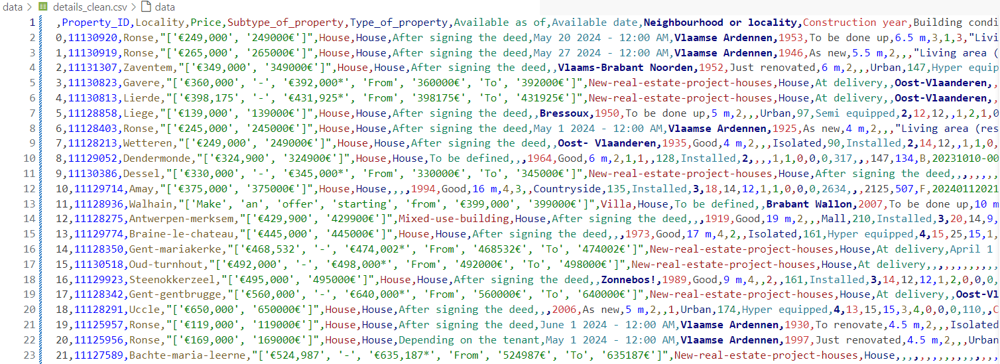

# Property Price Scraper

## Description
The Immoweb scraper is a Python program designed to extract information about properties for sale from the Immoweb website. It retrieves data from the website, organizes it into dictionaries, cleans the data, transforms it into a structured format, and saves it into a CSV file for further analysis.

## Features
* Scrapes Immoweb website for sale properties
* Extracts the details for each listing
* Cleans the data by removing duplicates and empty lines
* Saves the data to CSV files 

## Dependencies

* Python 3.12.1
* requests 2.31.0
* beautifulsoup4 4.12.3
* pandas 2.2.0

## Installation

1. Clone this repository to your local machine:

```cmd
git clone https://github.com/jduffy93/immo-eliza-scraping-the_chaincoders.git
```
2. Go to the **immo-eliza-scraping-the-chaincoders** directory:

```cmd
cd directory/immo-eliza-scraping-the-chaincoders
```

3. Install the required packages:

```cmd
pip install -r requirements.txt
```

## Running immo-eliza-scraping-the-chaincoders

Make sure you are in the correct directory (/immo-eliza-scraping-the-chaincoders), if not go to the directory:

 ```cmd
 cd directory/immo-eliza-scraping-the-chaincoders
 ```

Run immo-eliza-scraping-the-chaincoders from main:

```cmd
python main.py
```


## Output

The ouptuts for the data are saved in the ```data/``` folder as CSV files. Extra information with certain errors are saved in ```src/terminal_output.txt```.

Output preview:



## Roadmap

* Further improvements would include finding a solution to extract the "Type of sale" feature from the Immoweb website (New buildings and annuity sales, etc..). 
* Implementing a dynamic range of the pages scraped (instead of having a fixed limit of 333). 
* Automating the binary column conversion. 
* Increasing the pool of websites that the program is able to scrape.

## Outlook


The next step is to properly clean and perform exploratory data analysis on the dataset.

The dataset will later be used to create a predictive model of the property prices in Belgium.

